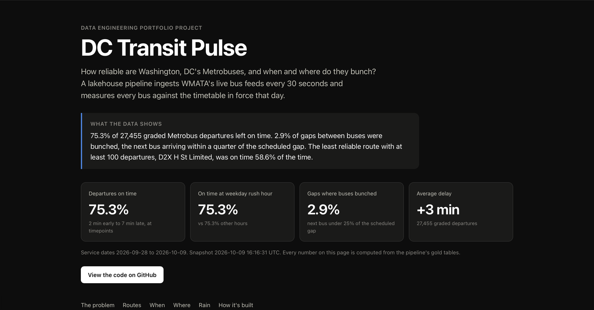
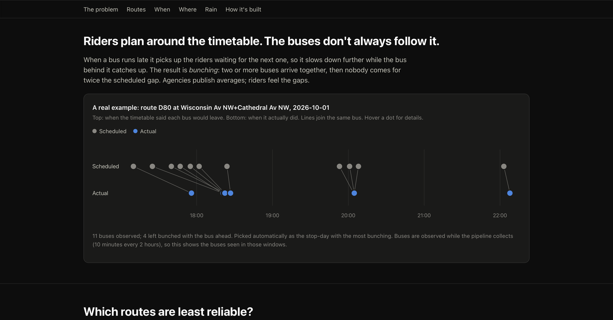
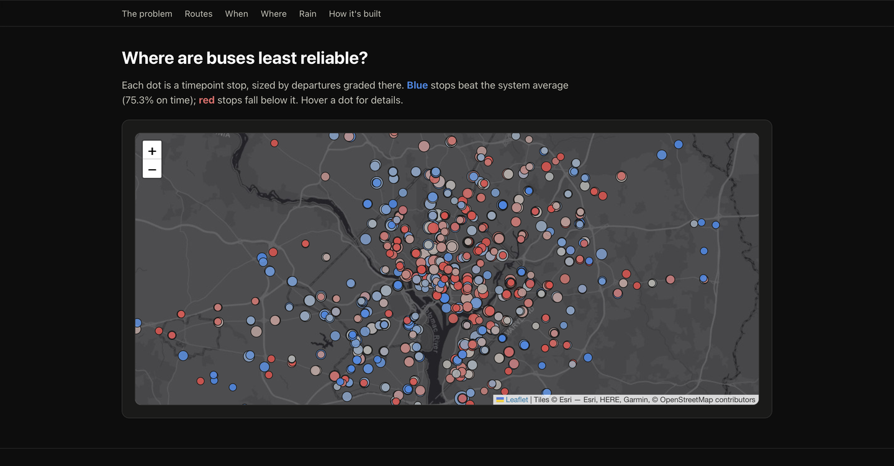

# DC Transit Pulse

How reliable are Washington, DC's Metrobuses, and when and where do they bunch?

A scheduled lakehouse pipeline on Databricks collects WMATA's live bus feeds every 30 seconds,
grades each departure against the timetable in force that day, and publishes the results to a
public site.

**Live site: https://dc-transit-pulse-eta.vercel.app**



## The problem

Riders plan around the timetable, and agencies publish monthly averages. A late bus picks up
the riders waiting for the next one, slows down further, and the bus behind catches up. Two buses
arrive together, then nobody comes for twice the scheduled gap. That is bunching, and an average
hides it. This project measures it per route, hour and stop from WMATA's own real-time data.



## Results

Measured over a window fixed in code before the data was in: **2026-10-02 to 2026-10-08, 7 full
days of scheduled runs** (`pipelines.metrics.MEASUREMENT_WINDOW`). Every number comes from a
query in [`benchmarks/queries.sql`](benchmarks/queries.sql); [`benchmarks/`](benchmarks/README.md)
explains the method.

| Metric | Result |
|---|---|
| Events ingested (both feeds) | 1.82M over 6 logged days: 303K a day on average, 176K to 426K |
| Freshness, newest departure to gold build | median 6.1 min, p95 7.0 min, worst 7.2 min (44 builds) |
| Duplicate and late rows removed | vehicle positions 5.9% (37,956 of 644,460), trip updates 2.7% (31,531 of 1,175,929) |
| Data-quality checks passed | 100%: 528 of 528 checks over 44 runs |
| Scheduled runs | 43 of 63 started (gap below); all 44 runs, including one manual, succeeded |
| Departures graded | 22,780 |
| On time (2 min early to 7 min late) | 75.5%: weekdays 74.7%, weekends 77.0% |
| Gaps where buses bunched | 2.7% of 15,925 gaps: weekdays 3.3%, weekends 1.6% |
| Clustering + OPTIMIZE | files 147 to 1 per silver table, 8 to 1 per gold table; query time unchanged at this size (below) |
| Our delay vs WMATA's own reported delay (validation) | r = 0.977 on 22,780 pairs, median difference 31 s, p90 91 s |
| Cost | $0 (Databricks Free Edition, Vercel Hobby, GitHub Actions on a public repo) |

**Gaps in the window.** The scheduler stopped starting runs after 12:00 ET on Oct 6 and resumed by
itself at 18:00 on Oct 8, while the schedule showed Active. No run failed; 20 of 63 scheduled runs
never started (5 on Oct 6, all 9 on Oct 7, 6 on Oct 8), and one run was started by hand at 17:15
on Oct 8 to confirm the job still worked. The cause was not found, so every number above covers 6
logged days, two of them partial, and Oct 7 has no data. The run-coverage query first reported 10
missed runs because it skipped days with no runs at all; that was fixed before these numbers were
taken. Separately, `silver_vehicle_positions` was found dropped on Oct 9 before measuring and was
restored intact with `UNDROP TABLE` (734,544 rows); nothing in the pipeline drops it on its own.

**Clustering, honestly.** Each benchmark query ran 5 times before and after, on the same compute.
The median went from 0.83 s to 0.73 s on the gold aggregate, 1.28 s to 1.30 s on a gold
route-and-day lookup, and 1.97 s to 2.22 s on a silver lookup. At under a million rows every query
is mostly fixed overhead, so file layout does not show up in query time yet; the measured win is
the compaction from 147 small files to 1, which keeps the next months of 2-hourly appends cheap.

### What the data shows

1. **About one departure in four is not on time.** 75.5% of 22,780 graded departures left between
   2 minutes early and 7 minutes late.
2. **Weekends are steadier; rush hour is not worse.** Weekends were 77.0% on time with half the
   bunching of weekdays (1.6% vs 3.3% of gaps). Weekday rush hour matched other hours (75.4% vs
   75.3% across the snapshot). An early 5-day sample said rush hour was worse (73.0% vs 75.8%);
   that difference disappeared with four times the data.
3. **Reliability depends on the route.** Among the 96 routes with at least 100 departures, on time
   ranges from 58.6% (D2X H St Limited) to 89.5% (F44 Columbia Pike-Pentagon). C53 U St-Congress
   Hts combines a low on-time rate (60.9%) with the most bunching of the large routes (9.3%).



### Limitations

- Buses are observed only while the job collects: 10 minutes every 2 hours, 06:00 to 22:00 ET.
  Results describe those windows, not every trip of the day.
- On time is graded at timepoints only, the stops where agencies measure punctuality. The 2 min
  early to 7 min late window follows common practice; check WMATA's current definition before
  comparing with its published figures.
- An observed departure is the midpoint of two GPS pings at most 120 s apart, so each one carries
  up to 60 s of error (stored per row as `max_error_s`).
- Weather is hourly for one point in DC, so "wet" means rain fell somewhere in that hour. The window
  had only 7 wet hours, too few to say anything about rain.
- Route and hour breakdowns on the site cover the whole snapshot (Sep 28 onward), not only the
  measurement window.

## Architecture

```mermaid
flowchart LR
  subgraph WMATA
    RT[GTFS-Realtime<br/>positions + trip updates]
    ST[GTFS static<br/>schedule zip]
  end
  subgraph Databricks job, every 2 h
    C[collect<br/>20 polls, 30 s apart] --> V[(Volume<br/>JSON Lines)]
    V --> B[bronze<br/>Auto Loader]
    B --> S[silver<br/>typed, deduped<br/>watermark + MERGE]
    S --> G[gold<br/>departures, on-time,<br/>headways]
    G --> Q[quality<br/>12 SQL checks]
    Q --> E[export<br/>CSV snapshot]
    W[weather<br/>Open-Meteo] --> G
  end
  RT --> C
  ST --> D[static tables + SCD Type 2<br/>routes and stops] --> G
  E --> GH[GitHub Action<br/>nightly commit]
  GH --> VC[Vercel<br/>static React site]
  E --> SL[Streamlit app]
```

## Design decisions and trade-offs

| Decision | Why | Trade-off |
|---|---|---|
| Producer runs as a job task, writing JSON Lines to a Volume | No laptop or extra cloud account; Auto Loader reads JSON natively | Polls only while the job runs, not 24/7 |
| Auto Loader with `availableNow`, not an always-on stream | Exactly-once via checkpoints at batch cost | Latency is the schedule interval, not seconds |
| Watermark dedupe plus an insert-only MERGE in silver | The watermark bounds state; MERGE makes replays add 0 rows | Rows later than 30 minutes are dropped and counted |
| SCD Type 2 routes and stops, point-in-time joins | Each bus is graded against the timetable in force that day | More complex joins than a current-state table |
| Gold rebuilt incrementally from a high-water mark with `replaceWhere` | Reruns are no-ops; late rows rebuild only their dates | One extra log table to maintain |
| Built-in SQL quality checks instead of Great Expectations | Runs on serverless and in CI with no extra dependency | Fewer ready-made checks and reports |
| Dashboards read a snapshot published only after checks pass | No warehouse cost, no credentials in public apps | Data is as fresh as the last refresh (nightly) |
| Liquid clustering on `(service_date, route_id)` instead of partitions | About 126 routes x a few days would create tiny partitions | Requires a recent Databricks runtime |

## Repository layout

| Path | Purpose |
|---|---|
| `producer/` | Polls GTFS-RT feeds and writes raw snapshots to the landing zone |
| `pipelines/` | Databricks jobs: static load, bronze ingest, silver, gold |
| `dashboard/` | Streamlit app that reads the exported gold snapshot |
| `web/` | React showcase site (Vite, static) built from the same snapshot, for Vercel |
| `orchestration/` | The Databricks job as code and the step runner |
| `tests/` | pytest unit tests for transformations |
| `exploration/` | One-off scripts used to understand the feeds before designing schemas |
| `benchmarks/` | Measurement window, method and the exact metric queries |
| `docs/screenshots/` | Images used in this README |

## Local setup

```bash
python3 -m venv .venv
source .venv/bin/activate
pip install -r requirements-dev.txt
cp .env.example .env        # then put your real WMATA key in .env
set -a; source .env; set +a # export the variables into your shell
```

Run the producer (writes to `LANDING_DIR`, default `./data/landing`) and the tests:

```bash
python -m producer.fetch_gtfs_rt --once
python -m producer.fetch_gtfs_rt --max-polls 10
pytest
```

The Spark tests (silver, SCD Type 2) run on a local Spark + Delta session and are skipped
unless you install them (needs Java 17+): `pip install -r requirements-spark.txt`. CI runs everything.

On Databricks (Git folder + notebook), each module's docstring shows how to call it:

| Module | Builds |
|---|---|
| `pipelines/static_to_delta.py` | `static_<file>` tables from the GTFS static zip, one set per `feed_version` |
| `pipelines/bronze_ingest.py` | `bronze_vehicle_positions`, `bronze_trip_updates` with Auto Loader |
| `pipelines/silver_transform.py` | `silver_vehicle_positions`, `silver_trip_updates` (typed, deduped with a watermark and MERGE), `silver_quarantine` (rows that fail checks), plus `reconcile()` |
| `pipelines/static_silver.py` | `silver_stop_times` with GTFS times as seconds (hours can be >= 24) |
| `pipelines/dim_scd2.py` | `dim_routes`, `dim_stops` as SCD Type 2, and the view `silver_vehicle_positions_enriched` (point-in-time route join) |
| `pipelines/gold_marts.py` | `gold_timepoint_departures`, `gold_route_hour_performance` (on-time % and delay), `gold_headways`, `gold_route_hour_bunching` |
| `pipelines/weather.py` | `silver_weather_hourly` from Open-Meteo, and the view `gold_route_hour_weather` |
| `pipelines/quality.py` | Data-quality checks on silver and gold, results in `dq_results` |
| `pipelines/metrics.py` | The pipeline metrics (events per day, freshness, rows removed, DQ pass rate, runtimes) as SQL |
| `pipelines/export_dashboard.py` | Aggregated CSV snapshot of gold for the dashboard, plus `manifest.json` |
| `pipelines/optimize.py` | Liquid clustering + OPTIMIZE, with before/after benchmarks in `ops_benchmarks` |

## Scheduled job

`orchestration/workflow.json` defines one Databricks job of serverless tasks,
`collect -> bronze -> silver -> gold -> quality -> export`, plus an independent `weather` task, with retries. Every task appends a row to
`ops_run_log`, which is where events per day and data freshness are measured.

```bash
set -a; source .env; set +a
python -m orchestration.create_job --put-secret --run-now
```

The schedule is created paused; unpause it in the Jobs UI once a manual run succeeds.

### Metric definitions

| Metric | Definition |
|---|---|
| Observed departure | Midpoint of the last ping at or before a stop and the first ping past it; graded only if the two pings are at most 120 s apart |
| On time | From 2 minutes early to 7 minutes late against the scheduled departure, at timepoints |
| Bunched / gapped | Actual headway below 25% / above 150% of the scheduled gap between the same two trips |

Secrets live only in `.env` (git-ignored) locally and in Databricks secrets in the workspace.

## Dashboard

`dashboard/app.py` is a Streamlit app that tells the story in six tabs: the problem (with a real
bunching example), which routes, when, where (map of timepoints), rain, and how the pipeline is built.

It reads a **snapshot**, not a live connection. The `export` job task writes small aggregated CSVs
and a `manifest.json` to the Volume after the quality checks pass; `fetch_snapshot` copies them into
`dashboard/snapshot/`. A live query from a public app would need a running SQL warehouse and a
token stored in the app; the snapshot costs nothing to view and holds no credentials.

```bash
set -a; source .env; set +a
python -m dashboard.fetch_snapshot
pip install -r dashboard/requirements.txt
streamlit run dashboard/app.py
```

To publish it, commit `dashboard/snapshot/` and deploy `dashboard/app.py` on
[Streamlit Community Cloud](https://streamlit.io/cloud) (free, public URL).

### Showcase site (React, Vercel)

`web/` is a one-page static site (React + TypeScript, Recharts, Leaflet) that tells the same story for
someone who will not open a notebook. At build time it copies `dashboard/snapshot/` into the bundle, so
it is plain HTML, JS and CSV: free to host, no backend, no credentials.

```bash
cd web
npm install
npm run dev          # http://localhost:5173
npm test && npm run build
```

Deploy on [Vercel](https://vercel.com) (Hobby plan, free): import the GitHub repo, set **Root Directory**
to `web` (`web/vercel.json` pins the Vite build, because the repo's Python files would otherwise be
detected as a Python app), and optionally set `VITE_STREAMLIT_URL` to link the Streamlit app. Every
push to `main` that updates the snapshot redeploys the site.

`.github/workflows/refresh-snapshot.yml` keeps it current: every night at 03:30 UTC (after the last
job run) it downloads the published snapshot and commits it if it changed, which redeploys the site.
It needs repository secrets `DATABRICKS_HOST` and `DATABRICKS_TOKEN`; run it by hand from the Actions tab.

## Data sources

- WMATA Bus GTFS-Realtime: Vehicle Positions and Trip Updates ([developer.wmata.com](https://developer.wmata.com))
- WMATA Bus GTFS static schedule

## License

MIT
